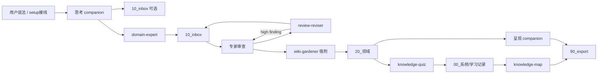

# Companion 协作流程（经验证）

> 本文说明本仓库 **companion 如何被唤起、如何交接、产物落哪**。  
> 契约由 `tests/test_companion_pipeline.py` + `tests/EVAL.md` §C3 锁定；改流程须先改测试再改文档。

相关：核心分工见根 [README.md](../README.md)；**已装用户更新与提示**见 [更新说明.md](./更新说明.md)；自定义见 [自定义与调教指南.md](./自定义与调教指南.md)；行为评测见 [tests/EVAL.md](../tests/EVAL.md)。

---

## 1. 角色：谁可以被唤起

| 层 | 包 | 唤起后负责 | 不负责 |
|---|---|---|---|
| 核心 | `setup-knowledge-skills` | 装完指路、列已装 companion | 定北极星、成文、吸附 |
| 核心 | `wiki-gardener` | 建库、吸附、园艺 | 写正文、选题诊断、做 PPT |
| 核心 | `domain-expert` | 执笔 / 事实审查 | 挂载进 `20_领域/` |
| 思考 companion | `grill-me` | 成文前追问（一次一问 + 推荐答案）→ 共识提纲 | 成文、吸附 |
| 思考 companion | `topic-resonate` | 选题真伪 / 文稿共鸣 | 代写、入库 |
| 思考 companion | `content-diagnose` | 选题通过后怎么做成内容 | 代写全文 |
| 思考 companion | `script-flow` | 口播逻辑延续 | 运营「该不该发」 |
| 思考 companion | `content-decomposer` | 对标拆解（有效/可参考/不可照搬/下一步） | 升格为领域定论 |
| 修订 companion | `review-reviser` | 按专家审查报告逐条修订草稿 | 自行判定通过、吸附 |
| 学习 companion | `knowledge-quiz` | 基于已入库知识测验并记录错题与掌握结果 | 把测验记录送入 inbox、替专家改来源事实 |
| 呈现 companion | `knowledge-map` | 只读知识与学习记录，生成知识图 | 修改掌握状态、吸附 |
| 呈现 companion | `frontend-slides` | HTML 演示 | 吸附 |
| 呈现 companion | `ian-xiaohei-illustrations` | 正文配图 | 吸附 |
| 呈现 companion | `gbro-cover-design` | 封面提示词（可选 MCP 直出） | 吸附 |

**唤起前提**：全量安装（`./scripts/install_skills.sh` 或 `--skill '*'`）会带上全部 companion。也可**选装**：只装核心，或按需 `--skill grill-me` 等。  
setup 会按 `assets/companion-catalog.json` 探测 `~/.agents/skills`、`~/.claude/skills`、`~/.codex/skills`、`~/.cursor/skills` 与工作区 `.cursor/skills`：**未装则推荐命令，不假装已可唤起**。详见 setup skill 的「1b. 可选安装推荐」。

---

## 2. 唤起机制（Agent 如何选中包）

1. **技能发现**：宿主扫描 `skills/*/SKILL.md` 的 `name` + `description`。  
2. **触发语**：各包 `description` 内嵌口语关键词（测试 `test_description_contains_invoke_phrases` 锁定），用户说法贴近这些词时更容易命中。  
3. **接线唤起**：用户没点名时，核心包按场景**点名交接**：

| 用户意图（示例） | 应由谁先接手 | 测试锁点 |
|---|---|---|
| 「刚装完，带我开始」 | setup | setup 列出 companion |
| 「想法很糊 / 帮我 grill」 | `grill-me` | setup 交接句 + grill description |
| 「一句话选题，写进库」 | 可先 grill，再 `domain-expert` | 园丁零散思路交接（须甩可复制「帮我 grill」句） |
| 「刚 update / 刷新技能包说明」 | setup | 念「更新提示」+ 重写 vault 技能包说明 |
| 「这个选题能不能打中人」 | `topic-resonate` | description 触发语 |
| 「选题过了，内容怎么做」 | `content-diagnose` | resonate→diagnose 交接 |
| 「稿子哪里会划走」 | `script-flow` | description + 存在性提醒 |
| 「按我的标准拆这条对标」 | `content-decomposer` | 园丁对标交接 |
| 「按审查报告修订这篇」 | `review-reviser` | finding 处理账本 + high 项复审 |
| 「考我 / 知识测验 / 理解检查 / 错题复习」 | `knowledge-quiz` | 已入库知识 → `00_系统/学习记录/` |
| 「知识地图 / 思维导图 / 结构化理解 / 掌握地图」 | `knowledge-map` | 只读汇总 → `90_export/` |
| 「做成 HTML 演示 / PPT 转换 / PDF 导出 / 配图 / 封面」 | 对应呈现包 | description + `90_export` |

---

## 3. 验证后的推荐流水线

```text
想清楚（思考 companion）
    → 成文 / 审查（domain-expert）→ 按需修订（review-reviser）→ 10_inbox/
    → 吸附（wiki-gardener）→ 20_领域/
    → 学习检查（knowledge-quiz）→ 00_系统/学习记录/ → 知识图（knowledge-map）→ 90_export/
    → 对外呈现（呈现 companion）→ 90_export/
```



### 3.1 思考支路（细则）

| 起点 | 顺序 | 落盘 |
|---|---|---|
| 模糊主张 | `grill-me` → `domain-expert` | 提纲可进 inbox；正文必经专家 → inbox |
| 选题存疑 | `topic-resonate` →（过关）`content-diagnose` → 专家或 `script-flow` | 诊断单可 inbox；不过关停在思考层 |
| 对标材料 | `content-decomposer` →（可选）grill / 专家 → 吸附 | 拆解笔记标研读草稿，先审再挂 |
| 已有口播稿 | `script-flow`（问过后才改稿） | 改稿 → inbox；**不**等于运营放行 |

当用户明确在做短视频，或 vault 已有运营 / 编导域档案时，才启用 **存在性先于形态性**（运营审核 → 编导/脚本 → inbox）。`script-flow` / `content-diagnose` 插在审核前后辅助，**不能跳过审核冒充可拍**。

### 3.2 修订支路（细则）

- 输入：`domain-expert` 的结构化审查报告 + 对应草稿。
- `review-reviser` 先列 finding → 修改位置 → 验收方式，用户批准后才改文件。
- 输出仍是 `10_inbox/` 草稿，并附 finding 处理账本。
- 有 high finding 时必须回 `domain-expert` 复审；修订 skill 不得自行改成 `seedling` 或宣称通过。

### 3.3 呈现支路（细则）

- 输入：已成稿笔记或 `10_inbox/` 草稿均可。  
- 输出：**仅** `90_export/`（或用户指定路径）。`frontend-slides` 还支持 PPT/PPTX 转 HTML、PDF 导出和用户确认后的在线部署。
- **禁止**写入 `20_领域/`；误进 inbox 时园丁应提示挪到导出目录，不当作吸附成功。  
- **可选 MCP（宿主级）**：本机接好 `mcp-image` / `luma-vision` 时，`ian-xiaohei` 可直出配图、`gbro-cover` 在出提示词后可选直出封面；未配置则提示词 / shot list 回退。说明见 [MCP-图像能力.md](./MCP-图像能力.md)。核心 skill **不**硬绑 MCP。

### 3.4 学习支路（细则）

- 输入：已经吸附到 `20_领域/`、由 Atlas 可定位的知识；不以待审 inbox 草稿作为默认题源。
- `knowledge-quiz` 按 vault 内配置选择题型与范围，结果、错题和证据链接写入 `00_系统/学习记录/`。该目录是系统资产，不进入吸附主路径。
- 测验若暴露来源笔记的事实疑点，只把「疑点 + 来源笔记」交 `domain-expert` 走现有审查模式；专家不接管出题或掌握判定。
- `knowledge-map` 只读已入库知识与学习记录，产物导出到 `90_export/`。它不得根据展示结果回写掌握状态。

---

## 4. 落盘公约（铁律）

| 产物类型 | 路径 | frontmatter 习惯 |
|---|---|---|
| 提纲 / 诊断单 / 拆解 / 脚本改稿 / 专家正文 | `10_inbox/` | `origin: chat` 或 `reference`；`status: draft` |
| 按审查报告修订后的草稿 + finding 处理账本 | `10_inbox/` | 保持 `status: draft`，复审通过后再由用户确认状态 |
| 测验结果 / 错题 / 掌握证据 | `00_系统/学习记录/` | 系统资产；不进 inbox，不参与吸附 |
| 已吸附笔记 | `20_领域/` | 仅园丁吸附后写入 |
| 知识图 / HTML / 配图 / 封面提示词（及可选 MCP 成品图） | `90_export/` | 只读呈现，不进吸附主路径，不修改掌握状态 |
| 拒收供体 | `90_archive/` | 园丁归档 |

---

## 5. 如何自测「能正确唤起」

### 5.1 自动化（每次改 companion 必跑）

```bash
python3 scripts/validate_skills.py
python3 scripts/check_no_emoji.py
python3 -m pytest -v tests/test_companion_pipeline.py tests/test_skills_layout.py
```

锁定内容包括：包可被 `discover_skill_dirs` 发现、`description` 含触发语、setup/园丁/专家接线、思考→inbox、呈现→`90_export`、脚本检查不绕过存在性门。

### 5.2 行为评测（Agent 实跑）

见 [tests/EVAL.md](../tests/EVAL.md) **§C3**：

- C3-a grill → 专家  
- C3-b decomposer → inbox → 吸附  
- C3-c 呈现类拒绝进 `20_领域/`  
- C3-d 脚本检查不绕过存在性  
- C3-e 呈现 MCP 软接线（有则直出、无则提示词回退）  
- C3-f 审查 → 修订 → high 项复审 → 吸附

建议：全量安装后新开会话，对复制出的 fixture vault 逐条跑。

---

## 6. 故障对照

| 现象 | 先查 |
|---|---|
| 说了「grill / 拆对标 / 考我」却无对应技能 | `npx skills list -g` 是否有包；是否只用了局部 `--skill` 安装 |
| Agent 自称有 companion 但本机没有 | 违反 setup「勿编造」；重装全量或改接线 |
| 糊想法被园丁直接写成 `20_领域/` | 园丁须交接 grill/专家；对照 EVAL B3-E / C3-a |
| PPT/封面进了领域树 | 呈现包 / 园丁接线失败；对照 C3-c |
| 测验记录进了 inbox | 学习落点错误；应移到 `00_系统/学习记录/`，不触发吸附 |
| 知识图改了掌握状态 | `knowledge-map` 越权；它只能读取和呈现 |
| 只跑了 script-flow 就当可拍入库 | 违反存在性先于形态性；对照 C3-d |

---

## 7. 维护约定

- 新增 companion：放 `skills/<name>/`，在 setup 的 `assets/companion-catalog.json` 登记类别、触发语和默认落点，再更新本文与技能包说明。测试从 catalog 派生清单。
- 不把垂直行业写死进 companion 正文；平台细节留在 vault `domains/` 与 domain-seeds。  
- 禁止 emoji；改编来源保留各包 `NOTICE`。
