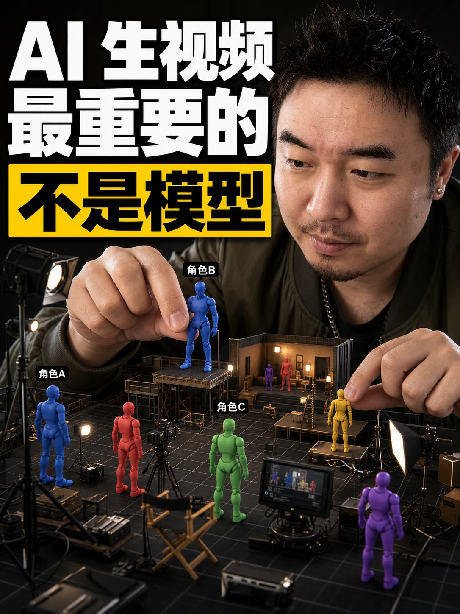

# gbro-cover-design

把文章扔给 agent，它读完内容、问你三轮问题，然后输出一段可以直接跑图的封面提示词。标题自动帮你想，构图逻辑全内置好了。画幅固定 3:4 竖版。

支持 Claude Code、Codex，以及任何支持自定义 skill 的 AI agent。

基于 [oh-my-cover-design](https://github.com/feitangyuan/oh-my-cover-design)（MIT）改进：提问压缩为三轮、10 种风格模板按需加载、内置示例提示词库做 few-shot、固定 3:4 画幅与安全区定义、新增首次使用配置引导。

---

## 效果

<table>
  <tr>
    <td></td>
    <td></td>
    <td></td>
    <td></td>
  </tr>
  <tr>
    <td></td>
    <td></td>
    <td></td>
    <td></td>
  </tr>
</table>

---

## 首次使用

第一次触发时 skill 会先带你完成配置（提示词必出；API key 不进本仓库）：

1. **人脸参考图**：准备一张清晰正脸照，存到 skill 的 assets 目录（文件名 my-face.png）做默认图1（也可以选每次上传）
2. **生图模型 / 后端**：确认跑图工具支持多参考图（本机 Cursor `mcp-image`、即梦/Seedream 4.0、Nano Banana、GPT-Image 等），否则难以保持人脸一致性

配置结果记在 skill 目录的 `config.md`，之后不再重复问。本机 MCP 接线说明见仓库根下的 `docs/MCP-图像能力.md`（密钥不入库）。

---

## 怎么用

把文章内容发给 agent，skill 自动触发，分三轮问你：

1. 构图风格（会先根据文章内容给推荐）+ 封面标题
2. 人脸参考图 + 产品截图等额外素材
3. 表情、背景色调、字体、字色（一次列出，没提的交给模型决定）

问完，**先输出提示词**（可拷到任意生图模型）。若本机已接 `mcp-image`，会再问要不要直出一张 3:4 封面到 `90_export/`；没有 MCP 或你只要提示词，到此结束。

---

## 10 种构图风格

| 风格 | 适合什么 |
|------|---------|
| 深色渐变风 | 人物居中，大字压在后面，冲击力最强 |
| 纯色扁平风 | 干净清爽，人物 + 道具 + 纯色背景 |
| 产品主视觉风 | 有 UI 截图或产品图时首选，截图占主体 |
| 对比卡片风 | 前后对比、好坏对比类内容专用 |
| 极简留白风 | 大留白，标题是唯一焦点，克制感强 |
| 海报拼贴风 | 素材多的时候用，多层叠加，纵深感强 |
| 人物侧置留白风 | 人物偏一侧，另一边全给标题，大气 |
| 背影构图风 | 人物背对镜头，适合励志、启发类内容 |
| 局部出镜风 | 只露手或半张脸，产品是绝对主角 |
| 正面对视风 | 直视镜头，眼神接触，情绪直接 |

每种风格的完整提示词模板在 `references/style-XX-*.md`，`references/examples.md` 里还有 8 组完整示例提示词做参照。

---

## 安装

```bash
npx skills@latest add tangzzz-fan/Wiki-Gardener-Skill -g -y \
  --skill gbro-cover-design
```

该命令会连同 `references/` 风格模板与示例一起安装；不要只复制 `SKILL.md`。

---

## 关于参考图

- **图1**：你自己的人脸照，skill 会在提示词里保持五官一致性
- **图2 起**：想放进封面的任何素材——产品图、UI 截图、品牌资产都行

---

## License

MIT，基于 feitangyuan 的 oh-my-cover-design 改进，原始版权信息见 LICENSE。
