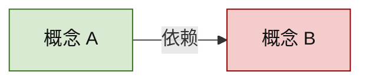

# Knowledge Map

把已有知识结构与个人掌握状态转成可追溯的 Mermaid Markdown。默认输出到 `90_export/`，来源笔记与学习状态均保持只读。

## 边界

- 读取 Atlas/MOC、`20_领域/` 笔记、标题、显式双链及 `00_系统/学习记录/掌握索引.md`。
- 禁止修改 `20_领域/`、MOC、双链或任何来源正文。
- 禁止修改掌握状态；个人掌握图只是索引当前状态的视图，不得根据图形推断或回写 `mastered`。
- 默认写入 `90_export/<主题>-知识地图.md`；用户可指定其他导出路径，但不得把导出物放入吸附主路径。
- 来源事实冲突或过时时，只标注并建议交给 `domain-expert`，不在图中擅自裁决。

## 选择地图类型

先确认用户要看什么：

1. 知识结构图：展示概念、主题、因果、依赖、对比和层级。
2. 个人掌握图：在相同结构上叠加 `unseen`、`learning`、`mastered`、`review_due`。

用户未指定时，根据请求判断；“思维导图”“结构化理解”默认结构图，“掌握地图”“我哪里没学会”默认掌握图。范围不清时只问一个会改变读取边界的问题。

## 读取顺序

1. 读取用户指定主题、目录或文件。
2. 找到相关 Atlas/MOC，确定主干和命名。
3. 沿范围内显式双链读取关系证据；不因关键词相似就虚构边。
4. 生成个人掌握图时，再读取掌握索引并按 `concept_id` 对齐来源标题。
5. 为每个节点保留 `[[来源笔记#标题]]`；无法定位标题的候选不进入正式图。

关系抽取与 Mermaid 约束见 `references/map-rules.md`。

## 生成知识结构图

按“主题主干优先、细节按需展开”组织：

- Atlas/MOC 提供一级分区。
- 标题与原子概念成为节点。
- 只使用有来源证据的关系：包含、依赖、导致、对比、例证、下一步。
- 边标签使用简短动词，避免“相关”这类不可验证关系。
- 节点显示短名称，节点后的来源清单保留完整 wikilink。

## 生成个人掌握图

先完成结构图，再将索引状态映射为 Mermaid class：

颜色只作辅助；状态必须同时出现在 Mermaid 后的文本图例或节点索引中。无索引记录的概念显示为 `unseen`。来源 fingerprint 已变化但索引尚未刷新时，标注“待状态刷新”，不得直接改索引。

## 导出格式

导出文件包含：

1. 标题、地图类型、生成时间与读取范围
2. Mermaid 图
3. 节点索引：节点 ID、名称、状态（掌握图）、`[[来源笔记#标题]]`
4. 关系依据：每条非层级关系及其来源
5. 未纳入项：来源不足、关系冲突或超出范围的候选

节点 ID 使用稳定、简短的 ASCII 标识；不要把文件路径直接当 Mermaid ID。标签中的引号和特殊字符必须转义。

## 完成标准

- 地图类型和读取范围明确。
- 每个正式节点都能追溯到 `[[来源笔记#标题]]`。
- 每条非层级边都有可指出的来源证据。
- 掌握图忠实呈现现有状态，没有修改掌握索引。
- 导出位于 `90_export/` 或用户明确指定的安全导出路径，未修改 `20_领域/`。
